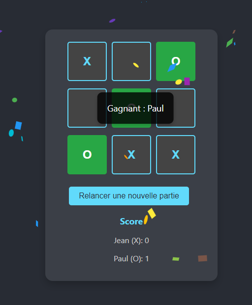

# Projet Tic Tac Toe avec React

Ce projet est un jeu de Tic Tac Toe interactif développé avec React. Il permet à deux joueurs de s'affronter sur un plateau de jeu 3x3. Le projet inclut plusieurs fonctionnalités avancées pour améliorer l'expérience utilisateur, telles que la saisie des pseudonymes des joueurs, l'annulation du dernier coup, et la gestion des scores.

## Aperçu de l'application

Voici un aperçu de l'interface utilisateur du jeu Tic Tac Toe :

| Avant la victoire                               | Après la victoire                              |
|-------------------------------------------------|------------------------------------------------|
|  |  |


## Prérequis

Avant de pouvoir lancer ce projet, assurez-vous d'avoir les éléments suivants installés sur votre machine :

- **Node.js** (version 14 ou supérieure) : Vous pouvez le télécharger depuis [nodejs.org](https://nodejs.org/).
- **npm** : Il est inclus avec Node.js, mais assurez-vous que la version est à jour en exécutant `npm install -g npm`.

## Installation

Suivez les étapes ci-dessous pour installer et lancer le projet localement :

1. **Cloner le dépôt** :
   
   Clonez ce dépôt sur votre machine locale en utilisant la commande suivante :

   ```bash
   git clone https://github.com/votre-utilisateur/tic-tac-toe.git
   ```

2. **Accéder au répertoire du projet** :

   Déplacez-vous dans le répertoire du projet :

   ```bash
   cd tic-tac-toe
   ```

3. **Installer les dépendances** :

   Utilisez npm pour installer toutes les dépendances nécessaires :

   ```bash
   npm install
   ```

## Lancer l'application

Pour démarrer l'application en mode de développement, exécutez la commande suivante :

```bash
npm start
```

Cette commande ouvrira automatiquement votre navigateur par défaut et chargera l'application à l'adresse suivante : `http://localhost:3000`.

## Fonctionnalités du jeu

Voici un aperçu des fonctionnalités disponibles dans ce jeu de Tic Tac Toe :

1. **Saisie des pseudonymes des joueurs** : Lors du chargement initial de l'application, les utilisateurs peuvent définir les noms des joueurs en utilisant un formulaire de saisie. Cela personnalise le jeu en affichant les noms des joueurs pendant la partie.

2. **Interface de jeu interactive** : Une interface utilisateur intuitive affiche un plateau de jeu 3x3, où les joueurs peuvent cliquer sur une case pour y placer leur symbole (X ou O).

3. **Détection de la victoire** : Le jeu détecte automatiquement le gagnant lorsque trois symboles identiques sont alignés horizontalement, verticalement ou en diagonale.

4. **Annulation du dernier coup** : Les joueurs ont la possibilité d'annuler leur dernier coup, à moins qu'un gagnant ait déjà été déterminé.

5. **Animation de Confettis** : Lorsqu'un joueur gagne, une animation de confettis est déclenchée pour célébrer la victoire.

6. **Overlay de Victoire** : Un message s'affiche au centre de la grille pour indiquer le nom du gagnant, créant un effet visuel attrayant.

7. **Bouton 'Relancer une nouvelle partie'** : Après une victoire, un bouton remplace les autres options pour permettre aux joueurs de relancer facilement une nouvelle partie.

8. **Gestion des scores** : Le jeu suit et affiche le nombre de parties gagnées par chaque joueur.

## Structure du projet

Voici un aperçu de la structure des fichiers et des dossiers dans ce projet :

```
tic-tac-toe/
│
├── public/
│   ├── index.html
│   └── ...
│
├── src/
│   ├── App.js          # Composant principal de l'application
│   ├── App.css         # Fichier CSS pour les styles de l'application
│   ├── index.js        # Point d'entrée principal pour React
│   └── ...
│
├── package.json        # Fichier de configuration du projet
└── README.md           # Documentation du projet
```

## Contribution

Les contributions sont les bienvenues ! Si vous avez des idées d'amélioration ou si vous trouvez des bugs, n'hésitez pas à ouvrir une *issue* ou une *pull request*.

## Licence

Ce projet est sous licence MIT. Vous êtes libre de l'utiliser, le modifier et le distribuer, sous réserve de maintenir la licence originale dans toutes les copies ou versions dérivées.

---

Merci d'avoir exploré ce projet ! J'espère que vous trouverez ce jeu amusant et engageant. N'hésitez pas à me contacter pour toute question ou suggestion d'amélioration.
